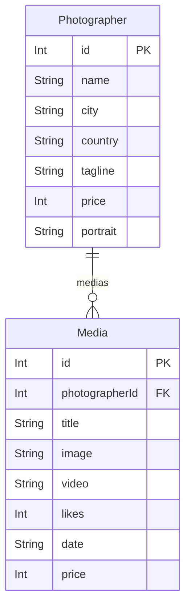

# P3 Développeur fullstack (FishEye) - Option NextJS

Ce dépôt contient le starter kit du projet FishEye pour les étudiants ayant choisi l'option NextJS.
Vous y trouverez : 
- un dossier `prisma` permettant de récupérer la base de données du projet prête à l'emploi. Placez ce dossier à la racine de votre projet NextJS.
- un dossier `assets` à placer également dans votre projet Next. Ce dossier contient toutes les images et vidéos liées aux données fournies dans le fichier précédent.

La base de données fonctionne grâce à SQLite via Prisma. Pour l'utiliser, il faudra installer Prisma (`npm install prisma@6 -D`) et générer les fichiers nécessaires avec `npx prisma generate`.

## Modèle de données

Le schéma Prisma définit deux modèles : `Photographer` et `Media`, liés par une relation un-à-plusieurs. Chaque `Media` référence son `Photographer` via le champ `photographerId`.

